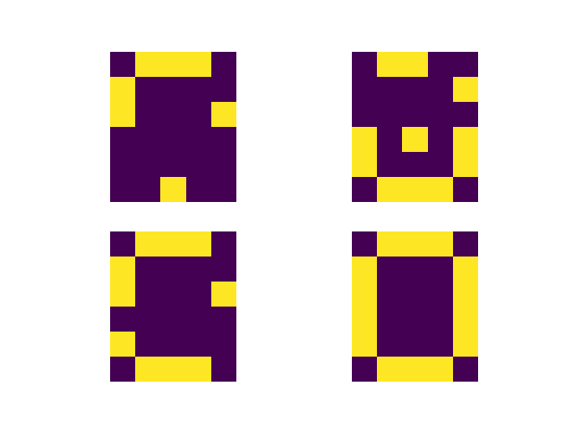
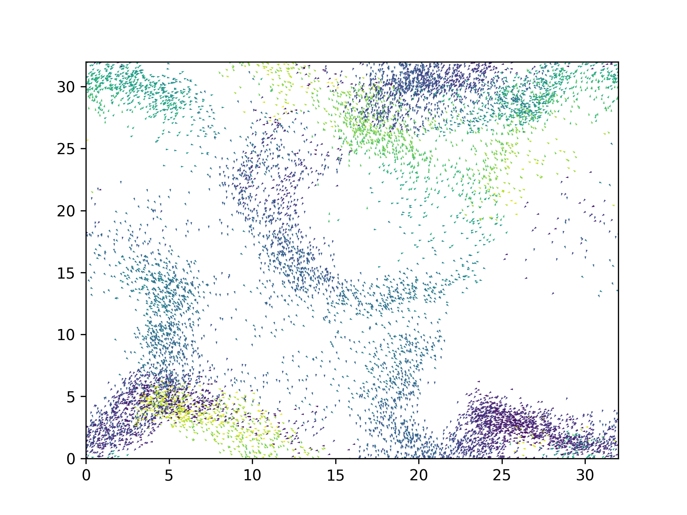

# ComputerModelingOfComplexSystems
This is a repository where I keep my solutions to the problems from class Computer Modeling of Complex Systems at my University.

## Lab 1 was an introductory lecture

## Lab 2 - Spin Glass

## Lab 3 - Starlings and Hawk

