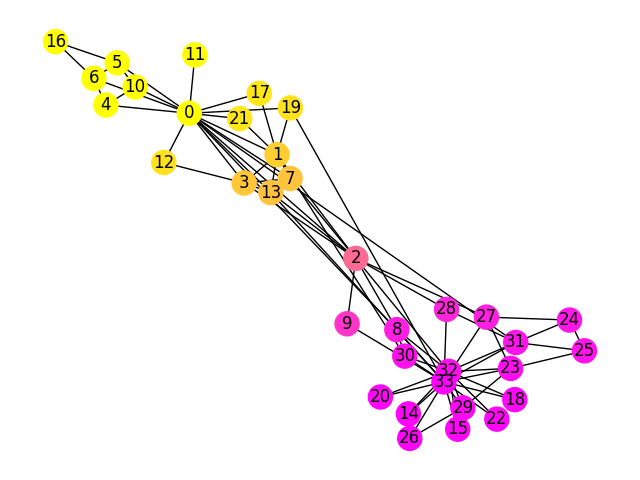
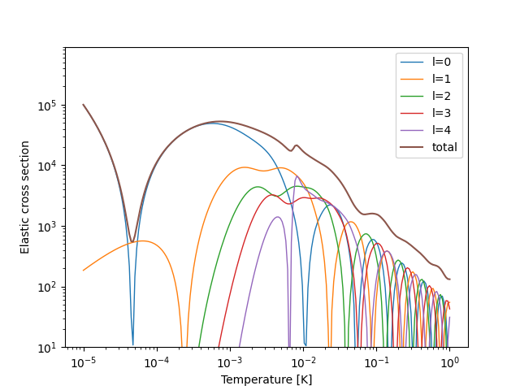
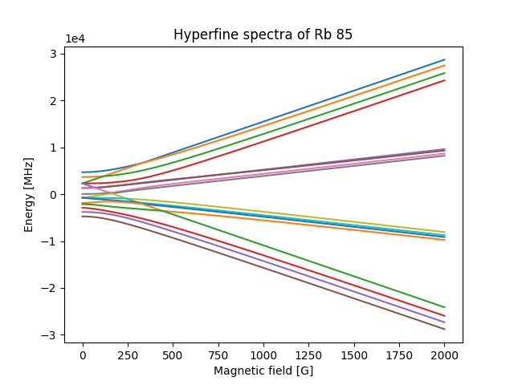
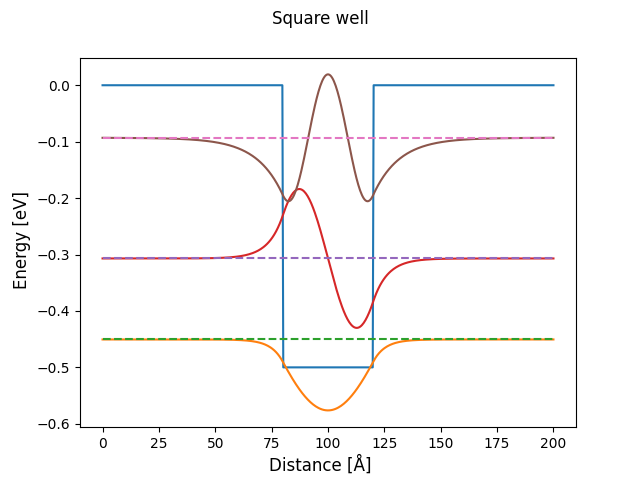

# ComputerModelingOfComplexSystems

This is a repository where I keep my solutions to the problems from class Computer Modeling of Complex Systems at my University.

# Snapshots from each class

## Lab 1 was an introductory lecture and discussion about this year's Nobel Prize

## Lab 2 - Spin Glass

## Lab 3 - Starlings and Hawk

## Lab 4 - Zachary's Karate Club

## Lab 5, 6, 7 - Ultracold Quantum Scattering (3 parts)

## Lab 8 - Nanostructures

